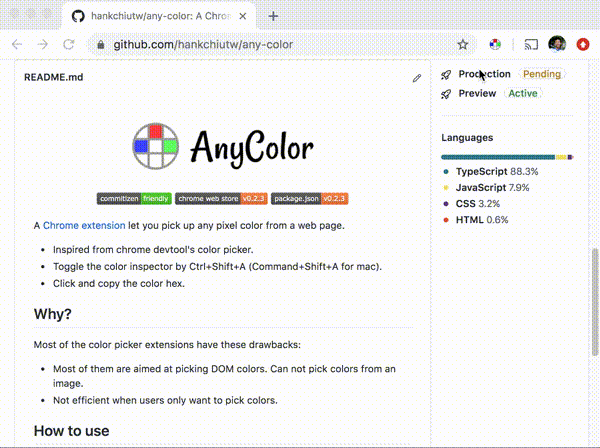

  
   
  
  
  

A [Chrome extension][webstore] that makes you pick up any pixel color from a web page.

- Inspired from Chrome devtool's color picker.
- Toggle the color inspector by Ctrl+Shift+A (Command+Shift+A for mac).
- Click and copy the color hex.

## Why?
Most of the color picker extensions have these drawbacks: 
- Most of them are aimed at picking DOM colors. Can not pick colors from an image.
- Not efficient when users only want to pick colors.

## How to use
[Install the extension][webstore] and toggle the color inspector by Ctrl+Shift+A (Command+Shift+A for mac). That's it.

## How it works
Mainly it uses [captureVisibleTab](https://developer.chrome.com/extensions/tabs#method-captureVisibleTab) API to the take the page screenshot. The image data is then rasterized and pixel colors are ready to use.

## License
[ Apache2 License ](LICENSE) © [hankchiu.tw](https://hankchiu.tw)

[webstore]: https://chrome.google.com/webstore/detail/any-color/cmehpadapglhhambdiafddpfjdngonba
